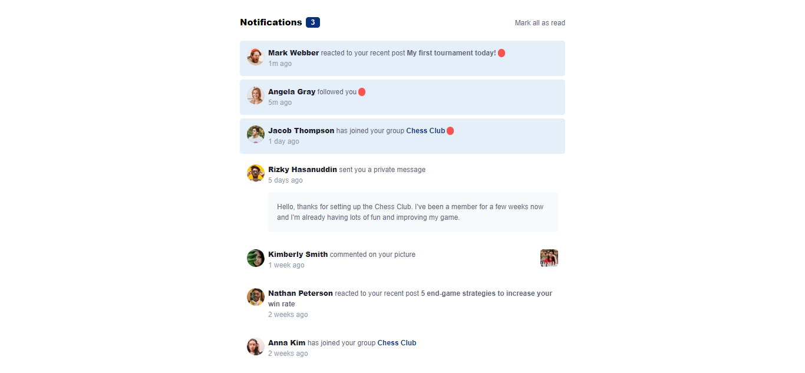

# Notifications page

Esta es una solución al [Notifications page challenge on Frontend Mentor](https://www.frontendmentor.io/challenges/notifications-page-DqK5QAmKbC). Los retos de Frontend Mentor te ayudan a mejorar tus habilidades de programación mediante la creación de proyectos realistas.

## Tabla de contenido

-   [Resumen](#resumen)
    -   [The challenge](#the-challenge)
    -   [Screenshot](#screenshot)
    -   [Link](#link)
-   [Descargar proyecto](#descargar-proyecto)
-   [Author](#author)

## Resumen

### The challenge

Los usuarios deben ser capaces de:

-   Distinguir entre notificaciones "no leídas" y "leídas
-   Seleccionar "Marcar todo como leído" para cambiar el estado visual de las notificaciones no leídas y poner a cero el número de mensajes no leídos.
-   Ver el diseño óptimo de la interfaz en función del tamaño de la pantalla del dispositivo.
-   Ver los estados "hover" y "focus" de todos los elementos interactivos de la página.

### Screenshot



### Link

-   URL del sitio web: [Notification page](https://notification-page-daniel-dev.vercel.app/)

### Construido con

-   Semantic HTML5 markup
-   CSS custom properties
-   Flexbox
-   Mobile-first workflow
-   JavaScript
-   [Tailwind](https://tailwindcss.com/) - CSS framework

## Descargar proyecto

### Prerrequisitos

Asegúrate de tener instalados los siguientes programas en tu computadora:

-   [Node.js](https://nodejs.org/) (Incluye npm)

### 1. Clonar el repositorio

Primero, clona el repositorio en tu computadora utilizando git:

```bash
git clone https://github.com/tu-usuario/notifications-page.git
```

### 2. Navegar al directorio del proyecto

Cambia el directorio a la carpeta del proyecto clonado:

```bash
cd notifications-page
```

### 3. Instalar las dependencias
Instala las dependencias del proyecto usando npm:

```bash
npm install
```

### 4. Compilar y minificar archivos
Para compilar y minificar los archivos CSS y JavaScript, ejecuta el siguiente comando:

```bash
npm run build
```

### 5. Estructura del proyecto
Asegúrate de que la estructura de tu proyecto se vea de la siguiente manera:

```bash
notifications-page/
│
├── node_modules/
│
├── public/
│   └── css/
│   │   └── styles.css
│   └── js/
│       ├── script.js
│       └── functions.js
│
├── src/
│   ├── css/
│   │   └── tailwind.css
│   ├── js/
│   │   ├── script.js
│
├── .gitignore
├── package.json
├── package-lock.json
├── README.md
├── tailwind.config.js
└── webpack.config.js
```

### 6. Ejecutar el servidor local (opcional)
Para ver la página en tu navegador, puedes usar un servidor local como Live Server de VS Code:

1. Instala la extensión Live Server en VS Code.
2. Abre el proyecto en VS Code.
3. Haz clic derecho en el archivo index.html y selecciona "Open with Live Server".

## Author

-   LinkedIn - [Daniel Rodado](https://www.linkedin.com/in/daniel-rodado-b24432210/)
